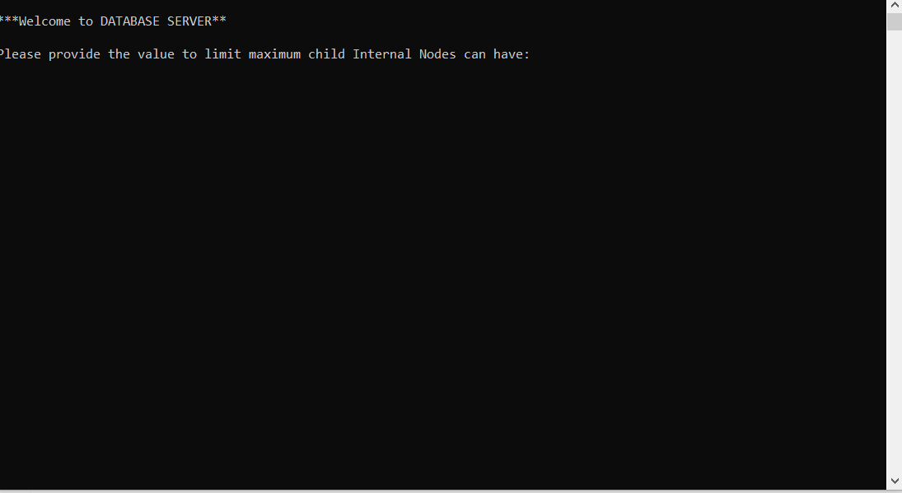
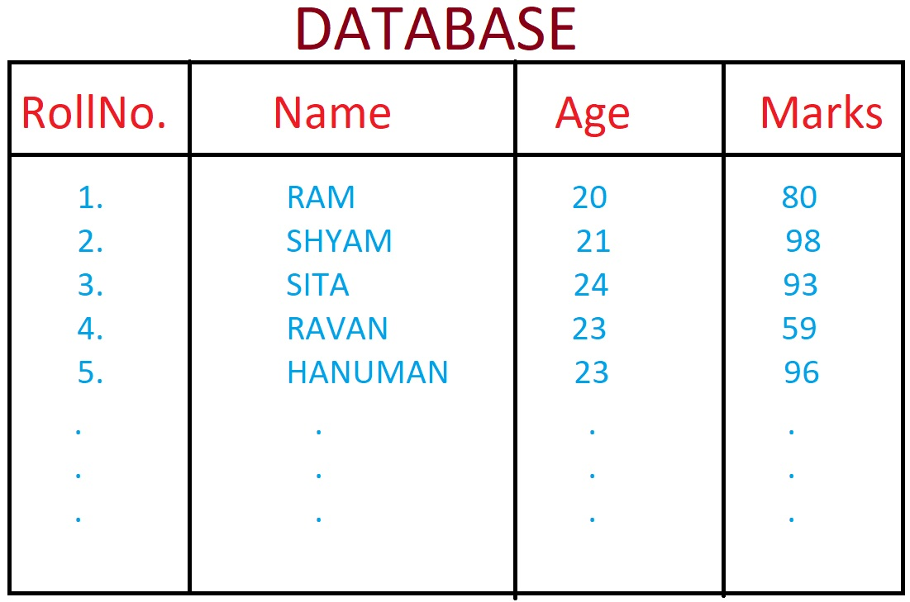
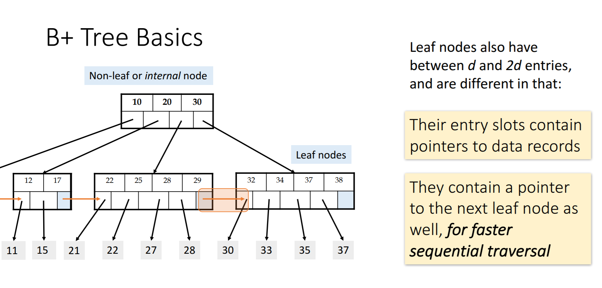
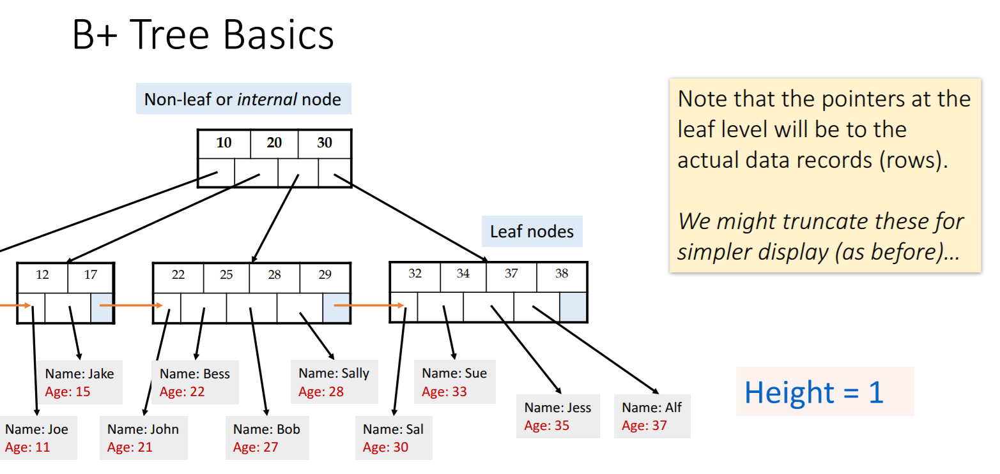
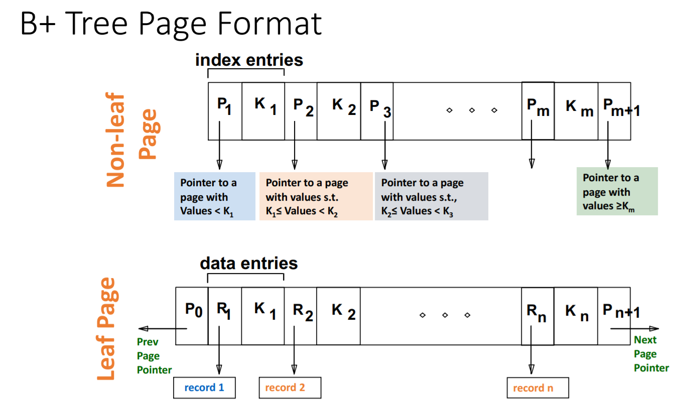
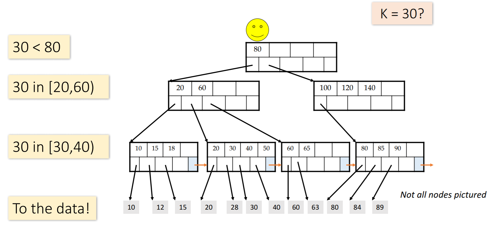
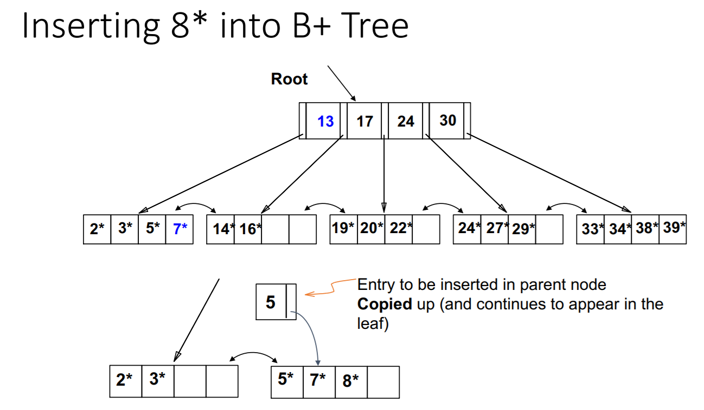
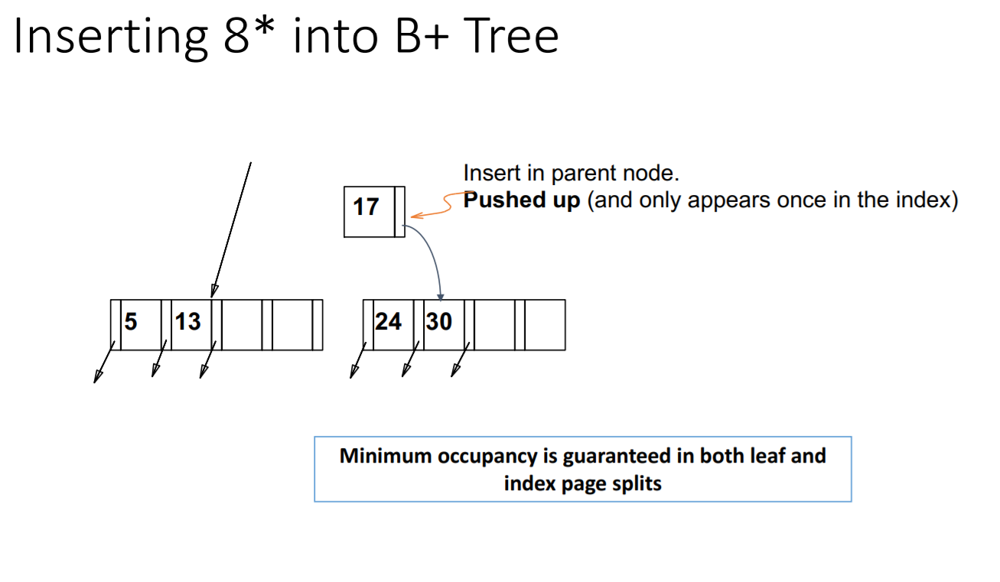
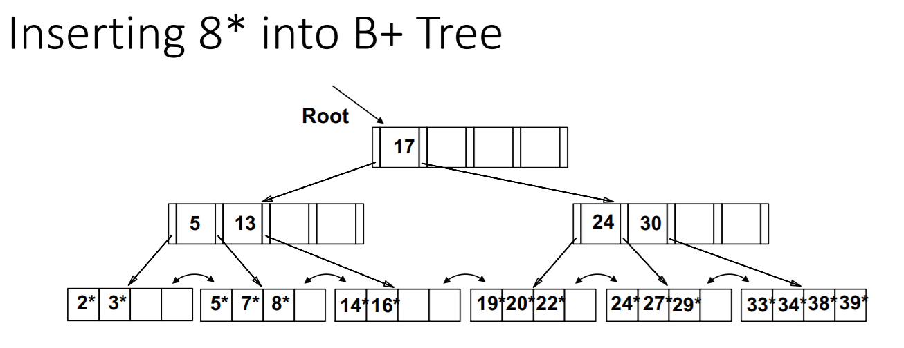

# B+ Tree
Implementing B+ tree using C++
- [x] Search 
- [X] Insert
- [X] Structuring the main Function
- [X] Delete

## Demo :

## Usage :

1.	Clone it to some place in your PC.
2.	Install Visual Studios Community Edition -2019. 
3.	File->create new project with existing code. 
4.	Take a chill beer Run the code and Enjoy.
(PS. Create an issue if you find any bug. Will be happy to fix it :))
HAPPY CODING !!

## Default DataBase Schema :

Our DataBase Schema Will look something like this-
	

## Summary- What is the project all about? 

This project is small version of database system. Where we efficiently implement the B+ Tree for fast and efficient access
of files in the disc. Your database tuples will be stores as a .txt file in DBFiles folder corresponding FILE* will be saved in the 
leaf node. Above step is done to mimic the disc-block access. *(TO-DO Delete the files in DBFiles folder after each run)*. If we want
to make more tables then we can make that many BPTree objects !!

## Assumptions in our Tree :

1.	We are making a right biased tree. By this we mean if maxLimits are even we will split them
	in such a way that right sibling has one element greater.

2.	Insertion is based on the primary key. Hence all the properties of the primary key has to be followed.
	No dublicate insertion has to be done with same primary key!

3.	In the code we have used a ptr2parent which directly give access to the parent of the node with ease, which is little
	bit deviated from B+ Tree defination where we don't use it. Consequences of this are yet to be unfold. Meanwhile, I have
	added it as a  question in [stackoverflow](https://stackoverflow.com/questions/57831014/why-we-are-not-saving-the-parent-pointer-in-b-tree-for-easy-upward-traversal-in) (NOW IT HAS BEEN REMOVED AS IT WILL CREATE A MESS WHILE DELETION).

4.	We are saving the \*ptr2next explicitly while ideally it is saved as the last pointer in the pointerset. But here as we 
	are using union to save the memory and seperate the leaf and non-leaf nodes, because of this \*ptr2next is explicitly
	saved !!

## Some UseFul Properties of B+ Tree:

1. B+ Tree Unlike B Tree is defined by two order values one for leaf node and another for non-leaf node.
	Minimum 50% should hold on B+ Tree Node.
	a.	For Non-Leaf Nodes-
		i.	ceil(maxInternalLimit/2)<= #of children <= maxInternalLimit
		ii.	ceil(maxInternalLimit/2)-1<= #of keys <= maxInternalLimit-1
		
	b.	For Leaf Nodes-
		i.	ceil(maxLeafLimit/2)<= #of keys <= maxLeafLimit
		ii.	since Leaf node will point to the dataPtr. It will be of same size as maxLeafLimit to correspond
			to every key !!!

	
	
	

## Search:

1.	If x is non-leaf node, we seek for the first *i* for which **keyValue** which is greater 
	than or equal-to the key k searched for. After that search continues in the node pointed 
	by ***iptr2Tree***.

2.	If all the **keyValue** are smaller than k then, we continue to search in the node pointed
	by ***(maxInternalLimit)ptr2Tree***.

3.	If x is a leaf-node, we search if k is present in the node!

	

## Insertion:

There are two convention being followed for the insertion(according to the google what i found out)
where, if the current node becomes full then -

1.	First give an element to the left sibling and if that doesn't
work give an element to the right sibling and if this also doesn't work split it.

2.	Simply Split into two nodes.

**Major Drawback of 1**
	Increases I/O, especially if we	check both siblings!!!

We have followed 2nd method which was comparatively easy to implement with relatively less hustle. So, 
here is the complete algorithm for [reference](http://www.cburch.com/cs/340/reading/btree/index.html?fbclid=IwAR0QFRcpIVL19PdMtZU0-wG18f-rwGS4lNvzpEAsdaZCL7BrNRBuFffiPJ0)

Descend to the leaf node where leaf fits :
a.	If the node has empty space, insert the key/reference pair into the node and We are DONE!
b.	If the node is already full, split it into two nodes, distributing the keys evenly. 
	i.	If the node is leaf,take the copy of minimum in the second node and repeat this algorithm to 
		insert it in parent node.
	ii.	If the node is non-leaf, exclude the middle value during split and insert the excluded value into 
		the	parent.

Let's see what would happen if we insert 8 in the below tree :-
	
	
	
